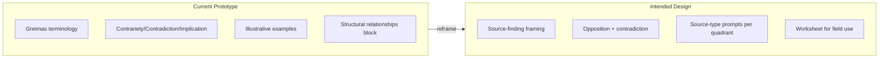
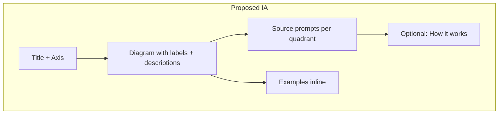

# CAJ Context Modeling Tool — App Rethink

## Context Summary

The prototype is part of a broader **Ethnographic Journalism Context Modeling Tools** suite for the Centre for Anthropology and Journalism. The attached documents reveal a significant gap between the current implementation and the intended audience, goals, and outputs.

### Key Documents


| Document              | Key insight                                                                                                                                                                                                                                                                                                                                    |
| --------------------- | ---------------------------------------------------------------------------------------------------------------------------------------------------------------------------------------------------------------------------------------------------------------------------------------------------------------------------------------------- |
| **Worksheet (PDF)**   | Step-by-step process: (1) list elements/sources, (2) find tensions → top corners, (3) find contradictions → bottom corners, (4) sources per element, (5) **fill in the gaps** — sources between 1–2, 2–3, 3–4, 1–4. Uses **8 source slots** (4 corners + 4 edges). Language: "opposition," "negation," "fill in the gaps" — not Greimas terms. |
| **EPIC MVP Proposal** | Primary purpose: **find "sources in between"** polarized coverage. Audience: engagement journalists, ethnographic reporters, students. Output: **source-type prompts** for each quadrant, not abstract relationships. Value: move beyond binary framing to surface diverse community voices.                                                   |
| **AI Prototype Spec** | Per-quadrant **source prompts** (2–4 types), evidence/quotes from input, **worksheet export** for field use. Multi-step: opposition → quadrants → source-prompts.                                                                                                                                                                              |


### Current vs. Intended




---

## Audience, Goals, and Needs

### Primary Audience

- **Engagement journalists** — community-centered reporting, care-based practices
- **Ethnographic reporters** — field notes, community discourse
- **Students** — anthropology/journalism, learning to translate methods into storytelling
- **Editors** — pitch sessions, editorial meetings

### Primary Goals

1. **Surface "sources in between"** — voices missed by binary "both sides" framing
2. **Make semiotic methods accessible** — no specialized training required
3. **Output actionable prompts** — what to look for in the field, not abstract theory
4. **Support worksheet workflow** — printable/exportable for editorial meetings and field use

### User Needs

- **Jargon-light entry** — "Find sources in between" vs. "Generate semiotic square"
- **Clear next steps** — "Who should I interview for this quadrant?" not "Here's the implication"
- **Worksheet alignment** — output that matches the familiar CAJ worksheet format
- **Optional depth** — theory available for those who want it, but not blocking

---

## Proposed Rethink

### 1. Reframe the Product (Decided)

**Current:** "Semiotic Square Context Modeling" — Greimas semiotic square, structural relationships, illustrative examples.

**Decided:** Keep **"Semiotic Square"** for recognition; add **"Source Mapping"** / **"Find Sources in Between"** for clarity. Explicitly differentiate from a pure Greimas square (this is a journalist-adapted tool).

- **Product name:** "Semiotic Square — Source Mapping" or similar dual framing
- **Tagline:** "Map story tensions and find voices in the gaps"
- **Help text:** Explain the method in journalist terms first; Greimas/semiotic square as optional "Learn more" for educators and curious users.

### 2. Reorder Information Architecture

**Current flow:** Diagram → Structural Relationships → Examples (accordion)

**Proposed flow:**

1. **Title + axis** — "This story maps [axis]"
2. **Interactive diagram** — 4 quadrants with labels + descriptions
3. **Source prompts** — Primary content: "Who to look for" per quadrant (2–4 concrete source types each)
4. **Optional: How it works** — Collapsible "Understanding the structure" for contrariety/contradiction/implication (or simplified: opposition, contradiction, in-between)
5. **Examples** — Inline in quadrants or as supporting chips (not a separate accordion)




### 3. Align Data Model with Source-Finding

**Current:** `examples[]` per quadrant — illustrative (e.g., "A DACA recipient who graduated...")

**Proposed:** Add or rename to `**sourcePrompts[]`** — actionable source types (e.g., "A resident who supports development but opposes this specific project"). The spec already defines this; the API may need to generate both or prioritize source prompts.

- **Source prompt:** "A [role/type] who [perspective]"
- **Rationale:** Brief explanation + optional evidence from input

**Worksheet alignment (Decided):** Implement **full 8-slot layout** in MVP — 4 corners + 4 edge positions ("between"), matching the CAJ worksheet exactly.

- **Corners (4):** Story element 1 (Source 1), Story element 2 (Source 2), Contradiction to 1 (Source 3), Contradiction to 2 (Source 4)
- **Edges (4):** Source between 1–2, 2–3, 3–4, 1–4 — voices in the gaps between adjacent positions

### 4. Worksheet Export

**Current:** PDF exports diagram, quadrants, relationships in a generic layout.

**Proposed:** PDF export that **matches the CAJ worksheet format**:

- Step 1–5 structure
- Blanks for: story elements (top), contradictions (bottom), sources per position
- Pre-filled from AI output where possible
- Printable for editorial meetings and field annotation

### 5. Two Modes (Decided: Both in MVP)


| Mode                 | Description                                                                                                    | Use case                                   |
| -------------------- | -------------------------------------------------------------------------------------------------------------- | ------------------------------------------ |
| **Quick analyze**    | Paste text → AI generates full map (current flow)                                                              | Fast turnaround, pitch review              |
| **Guided worksheet** | Step-by-step: (1) paste text, (2) confirm oppositions, (3) confirm contradictions, (4) generate source prompts | Teaching, workshops, deliberate reflection |


**Decided:** Include **guided mode** in MVP scope for EPIC. Both modes available; Quick analyze primary for demos, Guided for workshops/teaching.

### 6. Terminology Shift


| Current               | Proposed (primary)               | Greimas (optional) |
| --------------------- | -------------------------------- | ------------------ |
| Contrariety           | Opposition                       | Contrariety        |
| Contradiction         | Contradiction / negation         | Contradiction      |
| Implication           | In-between / complementary       | Implication        |
| Illustrative examples | Source prompts / Who to look for | —                  |


---

## Implementation Scope (MVP)

### Phase 1: IA and Framing (Core Rethink)

- Reframe product name: "Semiotic Square — Source Mapping" with dual framing; differentiate from Greimas
- Reorder ResultsPanel: Diagram → Source prompts (primary) → Optional "How it works"
- Add `sourcePrompts` to data model and API (or repurpose `examples` with new prompt)
- Inline or integrate examples into quadrants; remove separate accordion

### Phase 2: 8-Slot Layout

- **Data model:** Extend from 4 quadrants to 8 positions (4 corners + 4 edges)
- **Diagram:** New layout — corners + edge positions between them (worksheet-style grid)

```
         [1] ---- [1-2] ---- [2]
          |                   |
       [1-4]               [2-3]
          |                   |
         [4] ---- [3-4] ---- [3]
```

(Corners: 1,2 = oppositions; 3,4 = contradictions. Edges: sources in between.)

- **API:** Generate 8 positions with labels, descriptions, and source prompts each
- **Worksheet alignment:** Diagram matches CAJ worksheet (Source 1–4 corners, Source between 1–2, 2–3, 3–4, 1–4)

### Phase 3: Worksheet Export

- Redesign PDF export to match CAJ worksheet layout (steps 1–5, blanks, pre-filled content)
- 8-slot structure with source prompts prominent

### Phase 4: Guided Mode

- Step-by-step flow matching worksheet steps
- Confirmation steps: (1) paste text, (2) confirm oppositions (top corners), (3) confirm contradictions (bottom corners), (4) generate source prompts for all 8 slots
- Mode toggle: "Quick analyze" vs. "Guided worksheet" in nav or input area

---

## Files to Modify


| File                                                                             | Changes                                                                        |
| -------------------------------------------------------------------------------- | ------------------------------------------------------------------------------ |
| [app/page.tsx](app/page.tsx)                                                     | Header copy, help section reframe, mode toggle (Quick vs. Guided)              |
| [components/results-panel.tsx](components/results-panel.tsx)                     | IA reorder; 8-slot display; source prompts primary; relationships optional     |
| [components/semiotic-square-diagram.tsx](components/semiotic-square-diagram.tsx) | **8-slot layout** (corners + edges); source prompts; relationships collapsible |
| [app/api/generate-square/route.ts](app/api/generate-square/route.ts)             | 8-position schema; source prompts; updated prompt for 8 slots                  |
| [app/api/demo-square/route.ts](app/api/demo-square/route.ts)                     | 8-slot demo data                                                               |
| [components/nav-bar.tsx](components/nav-bar.tsx)                                 | Product name/tagline; mode toggle if placed in nav                             |
| PDF export logic (in results-panel)                                              | Worksheet-style layout with 8 slots                                            |
| **New:** Guided mode components                                                  | Step-by-step wizard; confirmation steps for oppositions/contradictions         |


---

## Decisions Summary


| Question      | Decision                                                                                                                         |
| ------------- | -------------------------------------------------------------------------------------------------------------------------------- |
| Product name  | Keep "Semiotic Square" for recognition; add "Source Mapping" / "Find Sources in Between" for clarity; differentiate from Greimas |
| 8-slot layout | Implement full 8-slot (4 corners + 4 edges) in MVP                                                                               |
| Guided mode   | Include in MVP scope for EPIC                                                                                                    |


